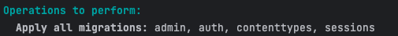

# Project info

---
### Description
- Web application called 'health_app' that allows users to log
their daily symptoms. Over time, their data will be stored and
the user can view a chart with information about their health.

- Users may log in via the home page as well as register for the app.

- Once a user logs in, they will be prompted with a checklist of available symptoms
as well as take user inputs for notes, scale of
symptoms, and more. 

# Setting up the project

---

### Create an application with Python, Django, and SQLite Database using PyCharm.

// Must have PyCharm installed as well as Python to begin.

1. Create a new project
2. Select Django
3. Create

- Once a project is created all the necessary files 
for Django will be included

---

### Create the database

1. ```python3 manage.py migrate```



2. To confirm that the database has been added run ```ls```

3. Your folder should now contain a `db.sqlite3` file

---

### Run the project

`python3 manage.py runserver`


Click the link to go to the web-page.
You should see a page created by Django, which lets you know
the server is running properly.

